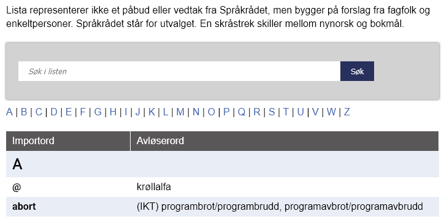
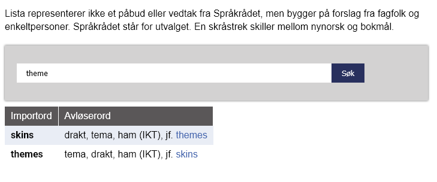
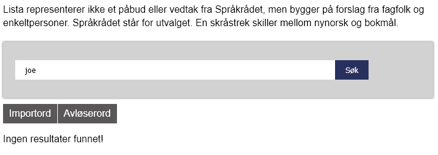

#  Språkrådet avløseord - search

Browser extension that implements search functionality for [språkrådets replacement word list](https://www.sprakradet.no/sprakhjelp/Skriverad/Avloeysarord/). Extension adds search input together with search query (sprakradet․no/sprakhjelp/Skriverad/Avloeysarord/?q={search term}) to the main site. Search results are presented by filtering the orginal table so it only contain results.

## Preview

Search form where user can enter search term:

Peformed search, results are shown as filtered table:

Situation with no search results:

## Installation
Extension is published on Firefox Browser Add-ons service (addons.mozilla.org) where it can be installed from.
Link to this extension on Firefox Browser Add-ons: https://addons.mozilla.org/en-US/firefox/addon/sprakradet-avloserord-search/

## Todo
- Currently there is a problem where id attribute links (".../#id") will not lead to given element while search is peformed. This is due to filtered table where search results are shown. 

